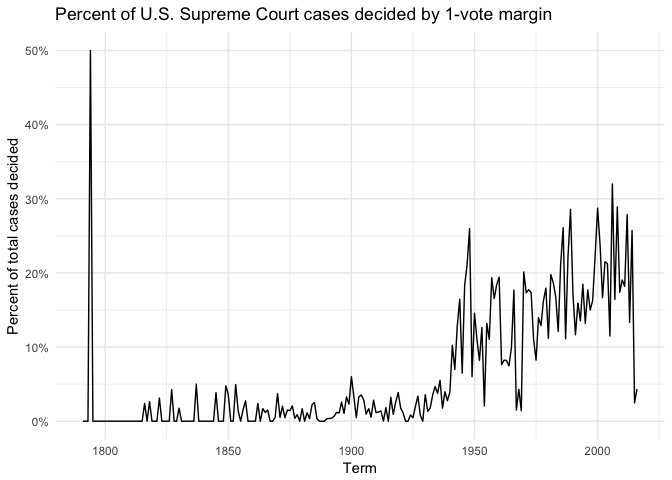
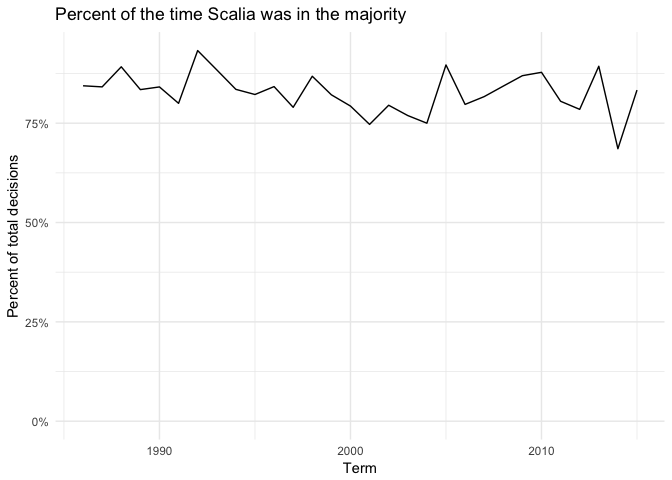
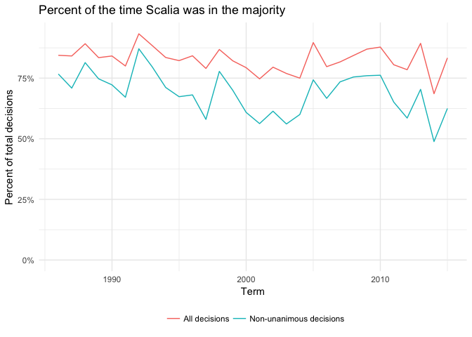
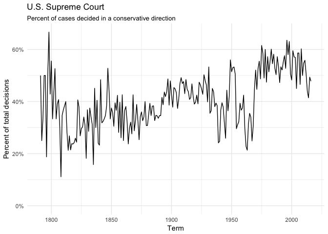
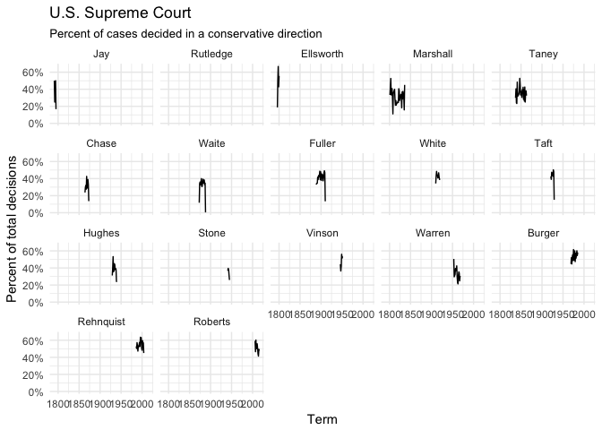
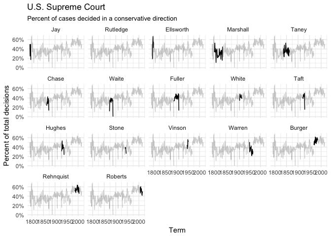
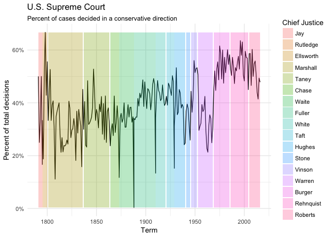

Exploring U.S. Supreme Court Decisions
================
Benjamin Soltoff
October 10, 2017

Get the data
------------

``` r
# load useful packages
library(tidyverse)

# set default theme
theme_set(theme_minimal())
```

``` r
scdbv_mod
```

    ## # A tibble: 78,857 x 61
    ##      caseId    docketId   caseIssuesId               voteId dateDecision
    ##       <chr>       <chr>          <chr>                <chr>        <chr>
    ##  1 1946-001 1946-001-01 1946-001-01-01 1946-001-01-01-01-01   11/18/1946
    ##  2 1946-001 1946-001-01 1946-001-01-01 1946-001-01-01-01-02   11/18/1946
    ##  3 1946-001 1946-001-01 1946-001-01-01 1946-001-01-01-01-03   11/18/1946
    ##  4 1946-001 1946-001-01 1946-001-01-01 1946-001-01-01-01-04   11/18/1946
    ##  5 1946-001 1946-001-01 1946-001-01-01 1946-001-01-01-01-05   11/18/1946
    ##  6 1946-001 1946-001-01 1946-001-01-01 1946-001-01-01-01-06   11/18/1946
    ##  7 1946-001 1946-001-01 1946-001-01-01 1946-001-01-01-01-07   11/18/1946
    ##  8 1946-001 1946-001-01 1946-001-01-01 1946-001-01-01-01-08   11/18/1946
    ##  9 1946-001 1946-001-01 1946-001-01-01 1946-001-01-01-01-09   11/18/1946
    ## 10 1946-002 1946-002-01 1946-002-01-01 1946-002-01-01-01-01   11/18/1946
    ## # ... with 78,847 more rows, and 56 more variables: decisionType <int>,
    ## #   usCite <chr>, sctCite <chr>, ledCite <chr>, lexisCite <chr>,
    ## #   term <int>, naturalCourt <int>, chief <chr>, docket <chr>,
    ## #   caseName <chr>, dateArgument <chr>, dateRearg <chr>, petitioner <int>,
    ## #   petitionerState <int>, respondent <int>, respondentState <int>,
    ## #   jurisdiction <int>, adminAction <int>, adminActionState <int>,
    ## #   threeJudgeFdc <int>, caseOrigin <int>, caseOriginState <int>,
    ## #   caseSource <int>, caseSourceState <int>, lcDisagreement <int>,
    ## #   certReason <int>, lcDisposition <int>, lcDispositionDirection <int>,
    ## #   declarationUncon <int>, caseDisposition <int>,
    ## #   caseDispositionUnusual <int>, partyWinning <int>,
    ## #   precedentAlteration <int>, voteUnclear <int>, issue <int>,
    ## #   issueArea <int>, decisionDirection <int>,
    ## #   decisionDirectionDissent <int>, authorityDecision1 <int>,
    ## #   authorityDecision2 <int>, lawType <int>, lawSupp <int>,
    ## #   lawMinor <chr>, majOpinWriter <int>, majOpinAssigner <int>,
    ## #   splitVote <int>, majVotes <int>, minVotes <int>, justice <int>,
    ## #   justiceName <chr>, vote <int>, opinion <int>, direction <int>,
    ## #   majority <int>, firstAgreement <int>, secondAgreement <int>

``` r
scdbv_leg
```

    ## # A tibble: 172,215 x 61
    ##      caseId    docketId   caseIssuesId               voteId dateDecision
    ##       <chr>       <chr>          <chr>                <chr>        <chr>
    ##  1 1791-001 1791-001-01 1791-001-01-01 1791-001-01-01-01-01     8/3/1791
    ##  2 1791-001 1791-001-01 1791-001-01-01 1791-001-01-01-01-02     8/3/1791
    ##  3 1791-001 1791-001-01 1791-001-01-01 1791-001-01-01-01-03     8/3/1791
    ##  4 1791-001 1791-001-01 1791-001-01-01 1791-001-01-01-01-04     8/3/1791
    ##  5 1791-001 1791-001-01 1791-001-01-01 1791-001-01-01-01-05     8/3/1791
    ##  6 1791-002 1791-002-01 1791-002-01-01 1791-002-01-01-01-01     8/3/1791
    ##  7 1791-002 1791-002-01 1791-002-01-01 1791-002-01-01-01-02     8/3/1791
    ##  8 1791-002 1791-002-01 1791-002-01-01 1791-002-01-01-01-03     8/3/1791
    ##  9 1791-002 1791-002-01 1791-002-01-01 1791-002-01-01-01-04     8/3/1791
    ## 10 1791-002 1791-002-01 1791-002-01-01 1791-002-01-01-01-05     8/3/1791
    ## # ... with 172,205 more rows, and 56 more variables: decisionType <int>,
    ## #   usCite <chr>, sctCite <chr>, ledCite <chr>, lexisCite <chr>,
    ## #   term <int>, naturalCourt <int>, chief <chr>, docket <chr>,
    ## #   caseName <chr>, dateArgument <chr>, dateRearg <chr>, petitioner <int>,
    ## #   petitionerState <int>, respondent <int>, respondentState <int>,
    ## #   jurisdiction <int>, adminAction <dbl>, adminActionState <dbl>,
    ## #   threeJudgeFdc <int>, caseOrigin <int>, caseOriginState <int>,
    ## #   caseSource <int>, caseSourceState <int>, lcDisagreement <int>,
    ## #   certReason <int>, lcDisposition <int>, lcDispositionDirection <int>,
    ## #   declarationUncon <int>, caseDisposition <int>,
    ## #   caseDispositionUnusual <int>, partyWinning <int>,
    ## #   precedentAlteration <int>, voteUnclear <int>, issue <int>,
    ## #   issueArea <int>, decisionDirection <int>,
    ## #   decisionDirectionDissent <int>, authorityDecision1 <int>,
    ## #   authorityDecision2 <int>, lawType <int>, lawSupp <int>,
    ## #   lawMinor <chr>, majOpinWriter <int>, majOpinAssigner <int>,
    ## #   splitVote <int>, majVotes <int>, minVotes <int>, justice <int>,
    ## #   justiceName <chr>, vote <int>, opinion <int>, direction <int>,
    ## #   majority <int>, firstAgreement <int>, secondAgreement <int>

Combine the datasets
--------------------

    ## # A tibble: 251,072 x 61
    ##      caseId    docketId   caseIssuesId               voteId dateDecision
    ##       <chr>       <chr>          <chr>                <chr>        <chr>
    ##  1 1946-001 1946-001-01 1946-001-01-01 1946-001-01-01-01-01   11/18/1946
    ##  2 1946-001 1946-001-01 1946-001-01-01 1946-001-01-01-01-02   11/18/1946
    ##  3 1946-001 1946-001-01 1946-001-01-01 1946-001-01-01-01-03   11/18/1946
    ##  4 1946-001 1946-001-01 1946-001-01-01 1946-001-01-01-01-04   11/18/1946
    ##  5 1946-001 1946-001-01 1946-001-01-01 1946-001-01-01-01-05   11/18/1946
    ##  6 1946-001 1946-001-01 1946-001-01-01 1946-001-01-01-01-06   11/18/1946
    ##  7 1946-001 1946-001-01 1946-001-01-01 1946-001-01-01-01-07   11/18/1946
    ##  8 1946-001 1946-001-01 1946-001-01-01 1946-001-01-01-01-08   11/18/1946
    ##  9 1946-001 1946-001-01 1946-001-01-01 1946-001-01-01-01-09   11/18/1946
    ## 10 1946-002 1946-002-01 1946-002-01-01 1946-002-01-01-01-01   11/18/1946
    ## # ... with 251,062 more rows, and 56 more variables: decisionType <int>,
    ## #   usCite <chr>, sctCite <chr>, ledCite <chr>, lexisCite <chr>,
    ## #   term <int>, naturalCourt <int>, chief <chr>, docket <chr>,
    ## #   caseName <chr>, dateArgument <chr>, dateRearg <chr>, petitioner <int>,
    ## #   petitionerState <int>, respondent <int>, respondentState <int>,
    ## #   jurisdiction <int>, adminAction <dbl>, adminActionState <dbl>,
    ## #   threeJudgeFdc <int>, caseOrigin <int>, caseOriginState <int>,
    ## #   caseSource <int>, caseSourceState <int>, lcDisagreement <int>,
    ## #   certReason <int>, lcDisposition <int>, lcDispositionDirection <int>,
    ## #   declarationUncon <int>, caseDisposition <int>,
    ## #   caseDispositionUnusual <int>, partyWinning <int>,
    ## #   precedentAlteration <int>, voteUnclear <int>, issue <int>,
    ## #   issueArea <int>, decisionDirection <int>,
    ## #   decisionDirectionDissent <int>, authorityDecision1 <int>,
    ## #   authorityDecision2 <int>, lawType <int>, lawSupp <int>,
    ## #   lawMinor <chr>, majOpinWriter <int>, majOpinAssigner <int>,
    ## #   splitVote <int>, majVotes <int>, minVotes <int>, justice <int>,
    ## #   justiceName <chr>, vote <int>, opinion <int>, direction <int>,
    ## #   majority <int>, firstAgreement <int>, secondAgreement <int>

Recode variables as you find necessary
--------------------------------------

What percentage of cases in each term are decided by a one-vote margin (i.e. 5-4, 4-3, etc.)
--------------------------------------------------------------------------------------------



In each term he served on the Court, in what percentage of cases was Justice Antonin Scalia in the majority?
------------------------------------------------------------------------------------------------------------



Create a graph similar to above that compares the percentage for all cases versus non-unanimous cases (i.e. there was at least one dissenting vote)
---------------------------------------------------------------------------------------------------------------------------------------------------



In each term, what percentage of cases were decided in the conservative direction?
----------------------------------------------------------------------------------



The Chief Justice is frequently seen as capable of influencing the ideological direction of the Court. Create a graph similar to the one above that also incorporates information on who was the Chief Justice during the term.
-------------------------------------------------------------------------------------------------------------------------------------------------------------------------------------------------------------------------------

#### Solution using facets (not too much more difficult)



#### Solution using facets and showing whole data on each facet (getting harder)



#### Solution shading original graph with color-coded eras of Chief Justices (attempt at your own risk)



Session info
------------

``` r
devtools::session_info()
```

    ##  setting  value                       
    ##  version  R version 3.4.1 (2017-06-30)
    ##  system   x86_64, darwin15.6.0        
    ##  ui       X11                         
    ##  language (EN)                        
    ##  collate  en_US.UTF-8                 
    ##  tz       America/Chicago             
    ##  date     2017-10-10                  
    ## 
    ##  package    * version    date       source                              
    ##  assertthat   0.2.0      2017-04-11 CRAN (R 3.4.0)                      
    ##  backports    1.1.0      2017-05-22 CRAN (R 3.4.0)                      
    ##  base       * 3.4.1      2017-07-07 local                               
    ##  bindr        0.1        2016-11-13 CRAN (R 3.4.0)                      
    ##  bindrcpp   * 0.2        2017-06-17 CRAN (R 3.4.0)                      
    ##  boxes        0.0.0.9000 2017-07-19 Github (r-pkgs/boxes@03098dc)       
    ##  broom        0.4.2      2017-08-09 local                               
    ##  cellranger   1.1.0      2016-07-27 CRAN (R 3.4.0)                      
    ##  clisymbols   1.2.0      2017-05-21 cran (@1.2.0)                       
    ##  codetools    0.2-15     2016-10-05 CRAN (R 3.4.1)                      
    ##  colorspace   1.3-2      2016-12-14 CRAN (R 3.4.0)                      
    ##  compiler     3.4.1      2017-07-07 local                               
    ##  crayon       1.3.4      2017-10-03 Github (gaborcsardi/crayon@b5221ab) 
    ##  datasets   * 3.4.1      2017-07-07 local                               
    ##  devtools     1.13.3     2017-08-02 CRAN (R 3.4.1)                      
    ##  digest       0.6.12     2017-01-27 CRAN (R 3.4.0)                      
    ##  dplyr      * 0.7.4.9000 2017-10-03 Github (tidyverse/dplyr@1a0730a)    
    ##  evaluate     0.10.1     2017-06-24 CRAN (R 3.4.1)                      
    ##  forcats    * 0.2.0      2017-01-23 CRAN (R 3.4.0)                      
    ##  foreign      0.8-69     2017-06-22 CRAN (R 3.4.1)                      
    ##  ggplot2    * 2.2.1      2016-12-30 CRAN (R 3.4.0)                      
    ##  glue         1.1.1      2017-06-21 CRAN (R 3.4.1)                      
    ##  graphics   * 3.4.1      2017-07-07 local                               
    ##  grDevices  * 3.4.1      2017-07-07 local                               
    ##  grid         3.4.1      2017-07-07 local                               
    ##  gtable       0.2.0      2016-02-26 CRAN (R 3.4.0)                      
    ##  haven        1.1.0      2017-07-09 CRAN (R 3.4.1)                      
    ##  hms          0.3        2016-11-22 CRAN (R 3.4.0)                      
    ##  htmltools    0.3.6      2017-04-28 CRAN (R 3.4.0)                      
    ##  httr         1.3.1      2017-08-20 CRAN (R 3.4.1)                      
    ##  jsonlite     1.5        2017-06-01 CRAN (R 3.4.0)                      
    ##  knitr        1.17       2017-08-10 cran (@1.17)                        
    ##  labeling     0.3        2014-08-23 CRAN (R 3.4.0)                      
    ##  lattice      0.20-35    2017-03-25 CRAN (R 3.4.1)                      
    ##  lazyeval     0.2.0      2016-06-12 CRAN (R 3.4.0)                      
    ##  lubridate    1.6.0      2016-09-13 CRAN (R 3.4.0)                      
    ##  magrittr     1.5        2014-11-22 CRAN (R 3.4.0)                      
    ##  memoise      1.1.0      2017-04-21 CRAN (R 3.4.0)                      
    ##  methods    * 3.4.1      2017-07-07 local                               
    ##  mnormt       1.5-5      2016-10-15 CRAN (R 3.4.0)                      
    ##  modelr       0.1.1      2017-08-10 local                               
    ##  munsell      0.4.3      2016-02-13 CRAN (R 3.4.0)                      
    ##  nlme         3.1-131    2017-02-06 CRAN (R 3.4.1)                      
    ##  parallel     3.4.1      2017-07-07 local                               
    ##  pkgconfig    2.0.1      2017-03-21 CRAN (R 3.4.0)                      
    ##  plyr         1.8.4      2016-06-08 CRAN (R 3.4.0)                      
    ##  psych        1.7.5      2017-05-03 CRAN (R 3.4.1)                      
    ##  purrr      * 0.2.3      2017-08-02 CRAN (R 3.4.1)                      
    ##  R6           2.2.2      2017-06-17 CRAN (R 3.4.0)                      
    ##  Rcpp         0.12.13    2017-09-28 cran (@0.12.13)                     
    ##  readr      * 1.1.1      2017-05-16 CRAN (R 3.4.0)                      
    ##  readxl       1.0.0      2017-04-18 CRAN (R 3.4.0)                      
    ##  reshape2     1.4.2      2016-10-22 CRAN (R 3.4.0)                      
    ##  rlang        0.1.2      2017-08-09 CRAN (R 3.4.1)                      
    ##  rmarkdown    1.6        2017-06-15 CRAN (R 3.4.0)                      
    ##  rprojroot    1.2        2017-01-16 CRAN (R 3.4.0)                      
    ##  rstudioapi   0.6        2016-06-27 CRAN (R 3.4.0)                      
    ##  rvest        0.3.2      2016-06-17 CRAN (R 3.4.0)                      
    ##  scales       0.4.1      2016-11-09 CRAN (R 3.4.0)                      
    ##  stats      * 3.4.1      2017-07-07 local                               
    ##  stringi      1.1.5      2017-04-07 CRAN (R 3.4.0)                      
    ##  stringr    * 1.2.0      2017-02-18 CRAN (R 3.4.0)                      
    ##  tibble     * 1.3.4      2017-08-22 CRAN (R 3.4.1)                      
    ##  tidyr      * 0.7.0      2017-08-16 CRAN (R 3.4.1)                      
    ##  tidyselect   0.1.1      2017-07-24 CRAN (R 3.4.1)                      
    ##  tidyverse  * 1.1.1.9000 2017-07-19 Github (tidyverse/tidyverse@a028619)
    ##  tools        3.4.1      2017-07-07 local                               
    ##  utils      * 3.4.1      2017-07-07 local                               
    ##  withr        2.0.0      2017-07-28 CRAN (R 3.4.1)                      
    ##  xml2         1.1.1      2017-01-24 CRAN (R 3.4.0)                      
    ##  yaml         2.1.14     2016-11-12 CRAN (R 3.4.0)
