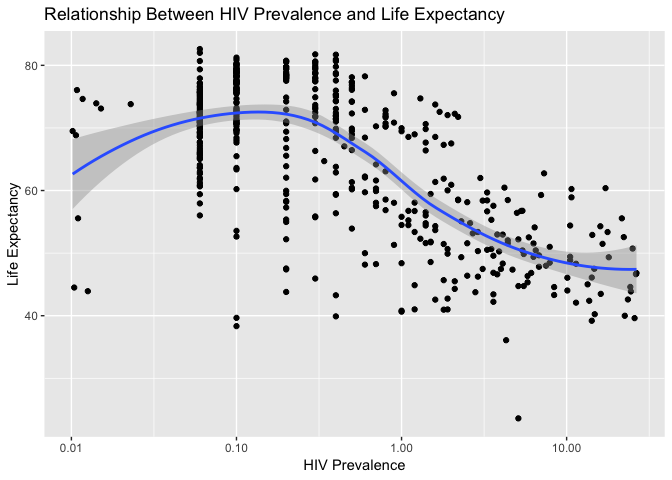

Joining Gapminder Data
================
Your name

Get the original data
=====================

``` r
library(tidyverse)
```

    ## ── Attaching packages ──────────────────────────────── tidyverse 1.2.1 ──

    ## ✔ ggplot2 3.0.0     ✔ purrr   0.2.5
    ## ✔ tibble  1.4.2     ✔ dplyr   0.7.6
    ## ✔ tidyr   0.8.1     ✔ stringr 1.3.1
    ## ✔ readr   1.1.1     ✔ forcats 0.3.0

    ## ── Conflicts ─────────────────────────────────── tidyverse_conflicts() ──
    ## ✖ dplyr::filter() masks stats::filter()
    ## ✖ dplyr::lag()    masks stats::lag()

``` r
library(gapminder)

gapminder
```

    ## # A tibble: 1,704 x 6
    ##    country     continent  year lifeExp      pop gdpPercap
    ##    <fct>       <fct>     <int>   <dbl>    <int>     <dbl>
    ##  1 Afghanistan Asia       1952    28.8  8425333      779.
    ##  2 Afghanistan Asia       1957    30.3  9240934      821.
    ##  3 Afghanistan Asia       1962    32.0 10267083      853.
    ##  4 Afghanistan Asia       1967    34.0 11537966      836.
    ##  5 Afghanistan Asia       1972    36.1 13079460      740.
    ##  6 Afghanistan Asia       1977    38.4 14880372      786.
    ##  7 Afghanistan Asia       1982    39.9 12881816      978.
    ##  8 Afghanistan Asia       1987    40.8 13867957      852.
    ##  9 Afghanistan Asia       1992    41.7 16317921      649.
    ## 10 Afghanistan Asia       1997    41.8 22227415      635.
    ## # ... with 1,694 more rows

Import the HIV data
===================

``` r
library(readr)
hiv <- read_csv("data/gapminder_hiv.csv")
```

    ## Parsed with column specification:
    ## cols(
    ##   country = col_character(),
    ##   year = col_integer(),
    ##   hivRate = col_double()
    ## )

What is the relationship between HIV prevalence and life expectancy?
====================================================================

``` r
#do inner join to add rate column
inner_join(gapminder, hiv) %>% 
  ggplot(aes(hivRate, lifeExp)) + geom_point()+ geom_smooth() + scale_x_log10() +labs(title = "Relationship Between HIV Prevalence and Life Expectancy", x = "HIV Prevalence", y = "Life Expectancy")
```

    ## Joining, by = c("country", "year")

    ## Warning: Column `country` joining factor and character vector, coercing
    ## into character vector

    ## `geom_smooth()` using method = 'loess' and formula 'y ~ x'



Which continents have the most countries with missing HIV data?
===============================================================

``` r
left_join(gapminder, hiv) %>% #keep all of gapminder
  filter(is.na(hivRate))%>%
  count(continent) %>%
  ggplot(aes(reorder(continent, -n), n)) + geom_col()+ labs(title = "Missing Observations by Country", x = "Continent", y = "Number of Missing Observations")
```

    ## Joining, by = c("country", "year")

    ## Warning: Column `country` joining factor and character vector, coercing
    ## into character vector


``` r
print("Africa had the most missing observations")
```

    ## [1] "Africa had the most missing observations"

Session info
------------

``` r
devtools::session_info()
```

    ## Session info -------------------------------------------------------------

    ##  setting  value                       
    ##  version  R version 3.3.3 (2017-03-06)
    ##  system   x86_64, darwin13.4.0        
    ##  ui       X11                         
    ##  language (EN)                        
    ##  collate  en_US.UTF-8                 
    ##  tz       America/Chicago             
    ##  date     2018-10-22

    ## Packages -----------------------------------------------------------------

    ##  package    * version date       source        
    ##  assertthat   0.2.0   2017-04-11 CRAN (R 3.3.2)
    ##  backports    1.1.2   2017-12-13 CRAN (R 3.3.2)
    ##  base       * 3.3.3   2017-03-07 local         
    ##  bindr        0.1.1   2018-03-13 CRAN (R 3.3.3)
    ##  bindrcpp   * 0.2.2   2018-03-29 CRAN (R 3.3.3)
    ##  broom        0.5.0   2018-07-17 CRAN (R 3.3.3)
    ##  cellranger   1.1.0   2016-07-27 CRAN (R 3.3.0)
    ##  cli          1.0.1   2018-09-25 CRAN (R 3.3.3)
    ##  colorspace   1.3-2   2016-12-14 CRAN (R 3.3.2)
    ##  crayon       1.3.4   2017-09-16 CRAN (R 3.3.2)
    ##  datasets   * 3.3.3   2017-03-07 local         
    ##  devtools     1.13.6  2018-06-27 CRAN (R 3.3.3)
    ##  digest       0.6.17  2018-09-12 CRAN (R 3.3.3)
    ##  dplyr      * 0.7.6   2018-06-29 CRAN (R 3.3.3)
    ##  evaluate     0.11    2018-07-17 CRAN (R 3.3.3)
    ##  fansi        0.3.0   2018-08-13 CRAN (R 3.3.3)
    ##  forcats    * 0.3.0   2018-02-19 CRAN (R 3.3.3)
    ##  gapminder  * 0.3.0   2017-10-31 CRAN (R 3.3.2)
    ##  ggplot2    * 3.0.0   2018-07-03 CRAN (R 3.3.3)
    ##  glue         1.3.0   2018-07-17 CRAN (R 3.3.3)
    ##  graphics   * 3.3.3   2017-03-07 local         
    ##  grDevices  * 3.3.3   2017-03-07 local         
    ##  grid         3.3.3   2017-03-07 local         
    ##  gtable       0.2.0   2016-02-26 CRAN (R 3.3.0)
    ##  haven        1.1.2   2018-06-27 CRAN (R 3.3.3)
    ##  hms          0.4.2   2018-03-10 CRAN (R 3.3.3)
    ##  htmltools    0.3.6   2017-04-28 CRAN (R 3.3.2)
    ##  httr         1.3.1   2017-08-20 CRAN (R 3.3.2)
    ##  jsonlite     1.5     2017-06-01 CRAN (R 3.3.2)
    ##  knitr        1.20    2018-02-20 CRAN (R 3.3.3)
    ##  labeling     0.3     2014-08-23 CRAN (R 3.3.0)
    ##  lattice      0.20-34 2016-09-06 CRAN (R 3.3.3)
    ##  lazyeval     0.2.1   2017-10-29 CRAN (R 3.3.2)
    ##  lubridate    1.7.4   2018-04-11 CRAN (R 3.3.3)
    ##  magrittr     1.5     2014-11-22 CRAN (R 3.3.0)
    ##  memoise      1.1.0   2017-04-21 CRAN (R 3.3.2)
    ##  methods    * 3.3.3   2017-03-07 local         
    ##  modelr       0.1.2   2018-05-11 CRAN (R 3.3.3)
    ##  munsell      0.5.0   2018-06-12 CRAN (R 3.3.3)
    ##  nlme         3.1-131 2017-02-06 CRAN (R 3.3.3)
    ##  pillar       1.3.0   2018-07-14 CRAN (R 3.3.3)
    ##  pkgconfig    2.0.2   2018-08-16 CRAN (R 3.3.3)
    ##  plyr         1.8.4   2016-06-08 CRAN (R 3.3.0)
    ##  purrr      * 0.2.5   2018-05-29 CRAN (R 3.3.3)
    ##  R6           2.2.2   2017-06-17 CRAN (R 3.3.2)
    ##  Rcpp         0.12.19 2018-10-01 CRAN (R 3.3.3)
    ##  readr      * 1.1.1   2017-05-16 CRAN (R 3.3.2)
    ##  readxl       1.1.0   2018-04-20 CRAN (R 3.3.3)
    ##  rlang        0.2.2   2018-08-16 CRAN (R 3.3.3)
    ##  rmarkdown    1.10    2018-06-11 CRAN (R 3.3.3)
    ##  rprojroot    1.3-2   2018-01-03 CRAN (R 3.3.2)
    ##  rstudioapi   0.8     2018-10-02 CRAN (R 3.3.3)
    ##  rvest        0.3.2   2016-06-17 CRAN (R 3.3.0)
    ##  scales       1.0.0   2018-08-09 CRAN (R 3.3.3)
    ##  stats      * 3.3.3   2017-03-07 local         
    ##  stringi      1.2.4   2018-07-20 CRAN (R 3.3.3)
    ##  stringr    * 1.3.1   2018-05-10 CRAN (R 3.3.3)
    ##  tibble     * 1.4.2   2018-01-22 CRAN (R 3.3.3)
    ##  tidyr      * 0.8.1   2018-05-18 CRAN (R 3.3.3)
    ##  tidyselect   0.2.4   2018-02-26 CRAN (R 3.3.3)
    ##  tidyverse  * 1.2.1   2017-11-14 CRAN (R 3.3.3)
    ##  tools        3.3.3   2017-03-07 local         
    ##  utf8         1.1.4   2018-05-24 CRAN (R 3.3.3)
    ##  utils      * 3.3.3   2017-03-07 local         
    ##  withr        2.1.2   2018-03-15 CRAN (R 3.3.3)
    ##  xml2         1.2.0   2018-01-24 CRAN (R 3.3.3)
    ##  yaml         2.2.0   2018-07-25 CRAN (R 3.3.3)
