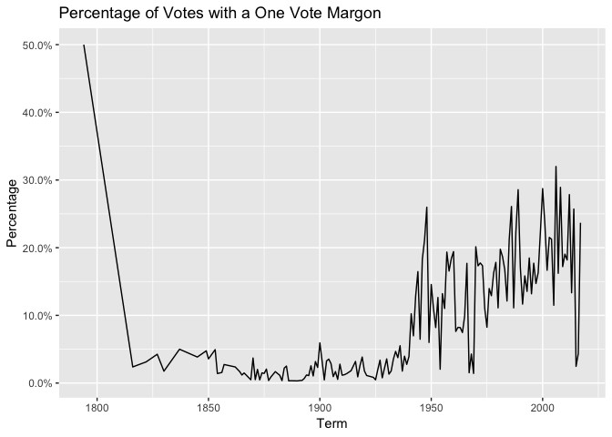

Exploring U.S. Supreme Court Decisions
================
Abby Bergman

Get the data
------------

``` r
# load useful packages
library(tidyverse)
```

    ## ── Attaching packages ───────────── tidyverse 1.2.1 ──

    ## ✔ ggplot2 3.0.0     ✔ purrr   0.2.5
    ## ✔ tibble  1.4.2     ✔ dplyr   0.7.6
    ## ✔ tidyr   0.8.1     ✔ stringr 1.3.1
    ## ✔ readr   1.1.1     ✔ forcats 0.3.0

    ## ── Conflicts ──────────────── tidyverse_conflicts() ──
    ## ✖ dplyr::filter() masks stats::filter()
    ## ✖ dplyr::lag()    masks stats::lag()

``` r
library(lubridate)
```

    ## 
    ## Attaching package: 'lubridate'

    ## The following object is masked from 'package:base':
    ## 
    ##     date

``` r
# load data
scdbv_mod <- read_csv("data/SCDB_2018_01_justiceCentered_Citation.csv", guess_max = 100000)
```

    ## Parsed with column specification:
    ## cols(
    ##   .default = col_integer(),
    ##   caseId = col_character(),
    ##   docketId = col_character(),
    ##   caseIssuesId = col_character(),
    ##   voteId = col_character(),
    ##   dateDecision = col_character(),
    ##   usCite = col_character(),
    ##   sctCite = col_character(),
    ##   ledCite = col_character(),
    ##   lexisCite = col_character(),
    ##   chief = col_character(),
    ##   docket = col_character(),
    ##   caseName = col_character(),
    ##   dateArgument = col_character(),
    ##   dateRearg = col_character(),
    ##   lawMinor = col_character(),
    ##   justiceName = col_character()
    ## )

    ## See spec(...) for full column specifications.

``` r
scdbv_leg <- read_csv("data/SCDB_Legacy_04_justiceCentered_Citation.csv", guess_max = 100000)
```

    ## Parsed with column specification:
    ## cols(
    ##   .default = col_integer(),
    ##   caseId = col_character(),
    ##   docketId = col_character(),
    ##   caseIssuesId = col_character(),
    ##   voteId = col_character(),
    ##   dateDecision = col_character(),
    ##   usCite = col_character(),
    ##   sctCite = col_character(),
    ##   ledCite = col_character(),
    ##   lexisCite = col_character(),
    ##   chief = col_character(),
    ##   docket = col_character(),
    ##   caseName = col_character(),
    ##   dateArgument = col_character(),
    ##   dateRearg = col_character(),
    ##   lawMinor = col_character(),
    ##   justiceName = col_character()
    ## )
    ## See spec(...) for full column specifications.

``` r
scdbv_mod
```

    ## # A tibble: 79,612 x 61
    ##    caseId docketId caseIssuesId voteId dateDecision decisionType usCite
    ##    <chr>  <chr>    <chr>        <chr>  <chr>               <int> <chr> 
    ##  1 1946-… 1946-00… 1946-001-01… 1946-… 11/18/1946              1 329 U…
    ##  2 1946-… 1946-00… 1946-001-01… 1946-… 11/18/1946              1 329 U…
    ##  3 1946-… 1946-00… 1946-001-01… 1946-… 11/18/1946              1 329 U…
    ##  4 1946-… 1946-00… 1946-001-01… 1946-… 11/18/1946              1 329 U…
    ##  5 1946-… 1946-00… 1946-001-01… 1946-… 11/18/1946              1 329 U…
    ##  6 1946-… 1946-00… 1946-001-01… 1946-… 11/18/1946              1 329 U…
    ##  7 1946-… 1946-00… 1946-001-01… 1946-… 11/18/1946              1 329 U…
    ##  8 1946-… 1946-00… 1946-001-01… 1946-… 11/18/1946              1 329 U…
    ##  9 1946-… 1946-00… 1946-001-01… 1946-… 11/18/1946              1 329 U…
    ## 10 1946-… 1946-00… 1946-002-01… 1946-… 11/18/1946              1 329 U…
    ## # ... with 79,602 more rows, and 54 more variables: sctCite <chr>,
    ## #   ledCite <chr>, lexisCite <chr>, term <int>, naturalCourt <int>,
    ## #   chief <chr>, docket <chr>, caseName <chr>, dateArgument <chr>,
    ## #   dateRearg <chr>, petitioner <int>, petitionerState <int>,
    ## #   respondent <int>, respondentState <int>, jurisdiction <int>,
    ## #   adminAction <int>, adminActionState <int>, threeJudgeFdc <int>,
    ## #   caseOrigin <int>, caseOriginState <int>, caseSource <int>,
    ## #   caseSourceState <int>, lcDisagreement <int>, certReason <int>,
    ## #   lcDisposition <int>, lcDispositionDirection <int>,
    ## #   declarationUncon <int>, caseDisposition <int>,
    ## #   caseDispositionUnusual <int>, partyWinning <int>,
    ## #   precedentAlteration <int>, voteUnclear <int>, issue <int>,
    ## #   issueArea <int>, decisionDirection <int>,
    ## #   decisionDirectionDissent <int>, authorityDecision1 <int>,
    ## #   authorityDecision2 <int>, lawType <int>, lawSupp <int>,
    ## #   lawMinor <chr>, majOpinWriter <int>, majOpinAssigner <int>,
    ## #   splitVote <int>, majVotes <int>, minVotes <int>, justice <int>,
    ## #   justiceName <chr>, vote <int>, opinion <int>, direction <int>,
    ## #   majority <int>, firstAgreement <int>, secondAgreement <int>

``` r
scdbv_leg
```

    ## # A tibble: 172,213 x 61
    ##    caseId docketId caseIssuesId voteId dateDecision decisionType usCite
    ##    <chr>  <chr>    <chr>        <chr>  <chr>               <int> <chr> 
    ##  1 1791-… 1791-00… 1791-001-01… 1791-… 8/3/1791                6 2 U.S…
    ##  2 1791-… 1791-00… 1791-001-01… 1791-… 8/3/1791                6 2 U.S…
    ##  3 1791-… 1791-00… 1791-001-01… 1791-… 8/3/1791                6 2 U.S…
    ##  4 1791-… 1791-00… 1791-001-01… 1791-… 8/3/1791                6 2 U.S…
    ##  5 1791-… 1791-00… 1791-001-01… 1791-… 8/3/1791                6 2 U.S…
    ##  6 1791-… 1791-00… 1791-002-01… 1791-… 8/3/1791                2 2 U.S…
    ##  7 1791-… 1791-00… 1791-002-01… 1791-… 8/3/1791                2 2 U.S…
    ##  8 1791-… 1791-00… 1791-002-01… 1791-… 8/3/1791                2 2 U.S…
    ##  9 1791-… 1791-00… 1791-002-01… 1791-… 8/3/1791                2 2 U.S…
    ## 10 1791-… 1791-00… 1791-002-01… 1791-… 8/3/1791                2 2 U.S…
    ## # ... with 172,203 more rows, and 54 more variables: sctCite <chr>,
    ## #   ledCite <chr>, lexisCite <chr>, term <int>, naturalCourt <int>,
    ## #   chief <chr>, docket <chr>, caseName <chr>, dateArgument <chr>,
    ## #   dateRearg <chr>, petitioner <int>, petitionerState <int>,
    ## #   respondent <int>, respondentState <int>, jurisdiction <int>,
    ## #   adminAction <int>, adminActionState <int>, threeJudgeFdc <int>,
    ## #   caseOrigin <int>, caseOriginState <int>, caseSource <int>,
    ## #   caseSourceState <int>, lcDisagreement <int>, certReason <int>,
    ## #   lcDisposition <int>, lcDispositionDirection <int>,
    ## #   declarationUncon <int>, caseDisposition <int>,
    ## #   caseDispositionUnusual <int>, partyWinning <int>,
    ## #   precedentAlteration <int>, voteUnclear <int>, issue <int>,
    ## #   issueArea <int>, decisionDirection <int>,
    ## #   decisionDirectionDissent <int>, authorityDecision1 <int>,
    ## #   authorityDecision2 <int>, lawType <int>, lawSupp <int>,
    ## #   lawMinor <chr>, majOpinWriter <int>, majOpinAssigner <int>,
    ## #   splitVote <int>, majVotes <int>, minVotes <int>, justice <int>,
    ## #   justiceName <chr>, vote <int>, opinion <int>, direction <int>,
    ## #   majority <int>, firstAgreement <int>, secondAgreement <int>

Combine the datasets
--------------------

``` r
scdbv <- bind_rows(scdbv_leg, scdbv_mod)
```

Recode variables as you find necessary
--------------------------------------

``` r
#recoding to 0 and 1
scdbv <- scdbv %>%
mutate(majority = majority -1, datadecisionDirection = ifelse(decisionDirection == 3, NA, decisionDirection -1), justiceName = as.factor(justiceName),
         chief = as.factor(chief))
```

What percentage of cases in each term are decided by a one-vote margin (i.e. 5-4, 4-3, etc.)
--------------------------------------------------------------------------------------------

``` r
scdbv2 <- scdbv %>%
  mutate(margin = majVotes-minVotes) %>% #create margin column
  select(caseId, term, majVotes, minVotes, margin) %>% #select only the terms I want
  unique() %>%
  group_by(term)

#change values to percent and create graph
scdbv2%>%
  count(margin) %>% 
  mutate(percent = n / sum(n))%>%
  filter(margin == 1) %>%
  ggplot(aes(term, percent))+ geom_line() + labs(title = "Percentage of Votes with a One Vote Margon", x = "Term", y = "Percentage") + scale_y_continuous(labels = scales::percent)
```



In each term he served on the Court, in what percentage of cases was Justice Antonin Scalia in the majority?
------------------------------------------------------------------------------------------------------------

``` r
scdbv %>%
  filter(justiceName == "AScalia")%>%
  count(term, majority) %>%
  na.omit() %>%
  group_by(term) %>%
  summarise(all_n = sum(n), 
            all_maj = sum(n[majority==1])) %>%
  mutate(n_pct = all_maj/all_n) %>%
  ggplot(aes(term, n_pct)) + geom_line() + scale_y_continuous(labels=scales::percent, limits=c(0,NA)) +
  labs(title= "Percent of Time Scalia was in the Majority", x = "Term", y= "Percent of Total Decisions")
```


Create a graph similar to above that compares the percentage for all cases versus non-unanimous cases (i.e. there was at least one dissenting vote)
---------------------------------------------------------------------------------------------------------------------------------------------------

``` r
scdbv3 <- scdbv %>%
  filter(justiceName == "AScalia")%>%
  mutate(unani = ifelse(minVotes == 0,1,0)) %>%
  count(term, majority, unani) %>%
  na.omit() %>%
  group_by(term) %>%
  summarise(all_n = sum(n), all_maj = sum(n[majority==1]), nonUnani_maj = sum(n[majority==1 & unani==0 ]), nonUnani_n = sum(n[unani==0])) %>% #split based on whether decisions were unanimous
  gather(key = key, value = value, -term) %>%
  separate(key, into = c("type", "var"))%>%
  spread(var, value)%>%
  mutate(n_pct = maj/n, 
         type = factor(type, levels = c("all", "nonUnani"), labels = c("All Decisions", "Non-Unanimous Decisions")))
  
ggplot(scdbv3, aes(term, n_pct, color=type))+ #split plot by type
  geom_line()+
  scale_y_continuous(labels = scales::percent, limits=c(0,NA))+ 
  labs(titles = "Percent of Time Scalia was in the Majority", x="Term", y = "Percent of Total Decisions") + 
  theme(legend.position="bottom")
```


In each term, what percentage of cases were decided in the conservative direction?
----------------------------------------------------------------------------------

``` r
#combine data sets
question4 <- bind_rows(scdbv_leg, scdbv_mod)

#pull out decision direction
question4 %>%
  count(term, decisionDirection)%>%
  group_by(term) %>%
  na.omit %>%
  summarize(all_n =sum(n),
            conservative = sum(n[decisionDirection == 1])) %>%
  ggplot(aes(term,conservative/all_n)) + #create graph
  geom_line()+
  labs(title= "Percent of US Supreme Court Cases Won in a Conservative Direction", x = "Term", y = "Percent of Cases") +
  scale_y_continuous(labels = scales::percent, limits=c(0,NA)) #change scale to percent
```


In each term, how many of the term's published decisions were announced in a given month?
-----------------------------------------------------------------------------------------

``` r
#add column for decision month and label with name
test5 <- scdbv%>%
  filter(decisionType ==1 | decisionType ==6) %>%
  mutate(decision_month = month(mdy(dateDecision))) %>%
  mutate(decision_month = factor(decision_month, levels = c(10:12, 1:9), labels = month.name[c(10:12, 1:9)]))

#select only the columns I want
test6 <- test5 %>%
  select(term, decision_month, caseIssuesId)

#create a data frame that shows me the counts per term-month
test7 <- test6[!duplicated(test6$caseIssuesId),] %>%
  group_by(term, decision_month) %>%
  summarise(total_count = n())

#create graph
ggplot(test7, aes(reorder(decision_month, desc(decision_month)), total_count)) +
  geom_boxplot()+
  coord_flip() +
  labs(title = "Number of Published Decisions Per Month, by Term", x = "Term Month", y = "Number of Published Decisions in a Term-Month")
```


The Chief Justice is frequently seen as capable of influencing the ideological direction of the Court. Create a graph similar to the one above that also incorporates information on who was the Chief Justice during the term.
-------------------------------------------------------------------------------------------------------------------------------------------------------------------------------------------------------------------------------

``` r
#Please note: this question was attempetd but not finished, leaving it here but please don't feel like you need to grade it
scdbv6 <- scdbv %>%
  select(term, caseId, partyWinning, decisionDirection, chief) %>% #select only the terms I want
  unique() %>%
  group_by(term, chief)

scdbv6%>%
  count(decisionDirection) %>% 
  mutate(percent = n / sum(n))%>%
  filter(decisionDirection == 1)  %>%
  group_by(chief) %>%
  ggplot(aes(x = term, y = percent))+
  geom_path()+ 
  facet_wrap(~chief) + #split into facets
  labs(title = "Percent of Supreme Court Cases Decided in a Conservative Direction", subtitle = "Showing Chief Justice for a Given Term", y = "Percent of Cases", x = "Term") +
  scale_y_continuous(labels = scales::percent, limits=c(0,NA)) 
```

    ## geom_path: Each group consists of only one observation. Do you need to
    ## adjust the group aesthetic?


Session info
------------

``` r
devtools::session_info()
```

    ## Session info -------------------------------------------------------------

    ##  setting  value                       
    ##  version  R version 3.3.3 (2017-03-06)
    ##  system   x86_64, darwin13.4.0        
    ##  ui       X11                         
    ##  language (EN)                        
    ##  collate  en_US.UTF-8                 
    ##  tz       America/Chicago             
    ##  date     2018-10-22

    ## Packages -----------------------------------------------------------------

    ##  package    * version date       source        
    ##  assertthat   0.2.0   2017-04-11 CRAN (R 3.3.2)
    ##  backports    1.1.2   2017-12-13 CRAN (R 3.3.2)
    ##  base       * 3.3.3   2017-03-07 local         
    ##  bindr        0.1.1   2018-03-13 CRAN (R 3.3.3)
    ##  bindrcpp   * 0.2.2   2018-03-29 CRAN (R 3.3.3)
    ##  broom        0.5.0   2018-07-17 CRAN (R 3.3.3)
    ##  cellranger   1.1.0   2016-07-27 CRAN (R 3.3.0)
    ##  cli          1.0.1   2018-09-25 CRAN (R 3.3.3)
    ##  colorspace   1.3-2   2016-12-14 CRAN (R 3.3.2)
    ##  crayon       1.3.4   2017-09-16 CRAN (R 3.3.2)
    ##  datasets   * 3.3.3   2017-03-07 local         
    ##  devtools     1.13.6  2018-06-27 CRAN (R 3.3.3)
    ##  digest       0.6.17  2018-09-12 CRAN (R 3.3.3)
    ##  dplyr      * 0.7.6   2018-06-29 CRAN (R 3.3.3)
    ##  evaluate     0.11    2018-07-17 CRAN (R 3.3.3)
    ##  fansi        0.3.0   2018-08-13 CRAN (R 3.3.3)
    ##  forcats    * 0.3.0   2018-02-19 CRAN (R 3.3.3)
    ##  ggplot2    * 3.0.0   2018-07-03 CRAN (R 3.3.3)
    ##  glue         1.3.0   2018-07-17 CRAN (R 3.3.3)
    ##  graphics   * 3.3.3   2017-03-07 local         
    ##  grDevices  * 3.3.3   2017-03-07 local         
    ##  grid         3.3.3   2017-03-07 local         
    ##  gtable       0.2.0   2016-02-26 CRAN (R 3.3.0)
    ##  haven        1.1.2   2018-06-27 CRAN (R 3.3.3)
    ##  hms          0.4.2   2018-03-10 CRAN (R 3.3.3)
    ##  htmltools    0.3.6   2017-04-28 CRAN (R 3.3.2)
    ##  httr         1.3.1   2017-08-20 CRAN (R 3.3.2)
    ##  jsonlite     1.5     2017-06-01 CRAN (R 3.3.2)
    ##  knitr        1.20    2018-02-20 CRAN (R 3.3.3)
    ##  labeling     0.3     2014-08-23 CRAN (R 3.3.0)
    ##  lattice      0.20-34 2016-09-06 CRAN (R 3.3.3)
    ##  lazyeval     0.2.1   2017-10-29 CRAN (R 3.3.2)
    ##  lubridate  * 1.7.4   2018-04-11 CRAN (R 3.3.3)
    ##  magrittr     1.5     2014-11-22 CRAN (R 3.3.0)
    ##  memoise      1.1.0   2017-04-21 CRAN (R 3.3.2)
    ##  methods    * 3.3.3   2017-03-07 local         
    ##  modelr       0.1.2   2018-05-11 CRAN (R 3.3.3)
    ##  munsell      0.5.0   2018-06-12 CRAN (R 3.3.3)
    ##  nlme         3.1-131 2017-02-06 CRAN (R 3.3.3)
    ##  pillar       1.3.0   2018-07-14 CRAN (R 3.3.3)
    ##  pkgconfig    2.0.2   2018-08-16 CRAN (R 3.3.3)
    ##  plyr         1.8.4   2016-06-08 CRAN (R 3.3.0)
    ##  purrr      * 0.2.5   2018-05-29 CRAN (R 3.3.3)
    ##  R6           2.2.2   2017-06-17 CRAN (R 3.3.2)
    ##  Rcpp         0.12.19 2018-10-01 CRAN (R 3.3.3)
    ##  readr      * 1.1.1   2017-05-16 CRAN (R 3.3.2)
    ##  readxl       1.1.0   2018-04-20 CRAN (R 3.3.3)
    ##  rlang        0.2.2   2018-08-16 CRAN (R 3.3.3)
    ##  rmarkdown    1.10    2018-06-11 CRAN (R 3.3.3)
    ##  rprojroot    1.3-2   2018-01-03 CRAN (R 3.3.2)
    ##  rstudioapi   0.8     2018-10-02 CRAN (R 3.3.3)
    ##  rvest        0.3.2   2016-06-17 CRAN (R 3.3.0)
    ##  scales       1.0.0   2018-08-09 CRAN (R 3.3.3)
    ##  stats      * 3.3.3   2017-03-07 local         
    ##  stringi      1.2.4   2018-07-20 CRAN (R 3.3.3)
    ##  stringr    * 1.3.1   2018-05-10 CRAN (R 3.3.3)
    ##  tibble     * 1.4.2   2018-01-22 CRAN (R 3.3.3)
    ##  tidyr      * 0.8.1   2018-05-18 CRAN (R 3.3.3)
    ##  tidyselect   0.2.4   2018-02-26 CRAN (R 3.3.3)
    ##  tidyverse  * 1.2.1   2017-11-14 CRAN (R 3.3.3)
    ##  tools        3.3.3   2017-03-07 local         
    ##  utf8         1.1.4   2018-05-24 CRAN (R 3.3.3)
    ##  utils      * 3.3.3   2017-03-07 local         
    ##  withr        2.1.2   2018-03-15 CRAN (R 3.3.3)
    ##  xml2         1.2.0   2018-01-24 CRAN (R 3.3.3)
    ##  yaml         2.2.0   2018-07-25 CRAN (R 3.3.3)
